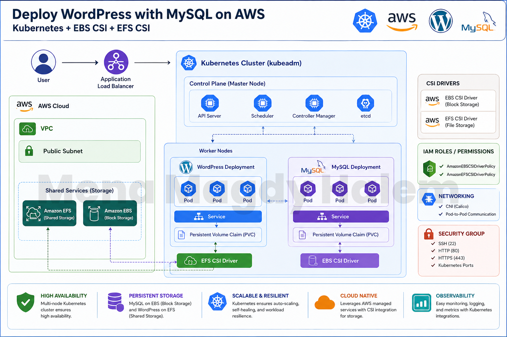
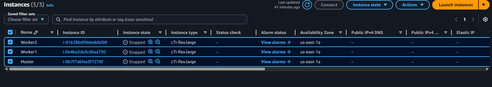

---

# 🚀 Deploy WordPress with MySQL on AWS (Kubernetes + CSI Drivers)

This project demonstrates how to deploy a highly available **WordPress application with a MySQL database** on AWS using a **self-managed Kubernetes cluster (kubeadm)** running on EC2 instances.

It integrates persistent storage using both:

* **Amazon EBS CSI Driver** → for MySQL (block storage)
* **Amazon EFS CSI Driver** → for WordPress (shared file system)

---

## 📌 Architecture Overview

* **3 EC2 Instances (Ubuntu)**

  * 1 Master Node
  * 2 Worker Nodes
* Kubernetes cluster initialized using `kubeadm`
* WordPress deployed as a stateless app (but uses shared storage)
* MySQL deployed with persistent storage (EBS volume)
* Storage handled via CSI drivers

## 📊 Architecture Diagram




---

## 🧰 Technologies Used

* Kubernetes (kubeadm)
* Docker / Container Runtime
* AWS EC2
* Amazon EBS (Block Storage)
* Amazon EFS (Shared File Storage)
* CSI Drivers
* kubectl

---

## ⚙️ Prerequisites

Before starting, ensure you have:

### 🖥️ Infrastructure

* ✅ 3 EC2 instances (Ubuntu recommended)

  * Minimum: t2.medium
* ✅ Security groups allowing:

  * SSH (22)
  * HTTP (80)
  * HTTPS (443)
  * Kubernetes ports (6443, 10250, etc.)

### ☁️ AWS Requirements

* AWS account
* IAM roles or credentials configured on instances like (ebsdriverpolicy,efsdriverpolicy)
* loadbalancer available
* EFS file system created (with mount targets in same VPC)

### ☸️ Kubernetes Setup

* kubeadm cluster initialized
* kubectl configured on master node
* CNI plugin installed (e.g., Calico)

### 📦 Storage Drivers

#### 1. Amazon EBS CSI Driver

* Required for MySQL persistent storage
* Handles lifecycle of EBS volumes in Kubernetes ([GitHub][1])

#### 2. Amazon EFS CSI Driver

* Required for shared WordPress storage
* Enables multiple pods to access the same filesystem ([GitHub][2])

---

## 🔐 IAM & Permissions (Important)

Since this is a **self-managed cluster (NOT EKS)**:

You must manually configure:

* IAM Roles
* OR attach permissions to EC2 instance profiles

### Required Policies:

* `AmazonEBSCSIDriverPolicy`
* `AmazonEFSCSIDriverPolicy`

Both drivers require IAM permissions to interact with AWS storage services ([docs.aws.amazon.com][3])

---

## 📂 Project Structure

```
.
├── mysql/
│   ├── mysql-deployment.yaml
│   ├── mysql-service.yaml
│   ├── mysql-pvc.yaml
|   └── ebs-storageclass.yaml
│
├── wordpress/
│   ├── wordpress-deployment.yaml
│   ├── wordpress-service.yaml
│   ├── wordpress-pvc.yaml
│   └── efs-storageclass.yaml
│
└── README.md
```

---

## 🚀 Deployment 

### 1️⃣ Clone the repository

```bash
git clone https://github.com/MenaMagdyHalem/Deploy-A-WordPress-Site-With-A-MySQL-Database-On-AWS.git
cd Devops_projects/Deploy\ A\ WordPress\ Site\ With\ A\ MySQL\ Database\ On\ AWS
```

---

### 2️⃣ Install CSI Drivers

#### Install EBS CSI Driver

```bash
kubectl apply -k "github.com/kubernetes-sigs/aws-ebs-csi-driver/deploy/kubernetes/overlays/stable/?ref=master"
```

#### Install EFS CSI Driver

```bash
kubectl apply -k "github.com/kubernetes-sigs/aws-efs-csi-driver/deploy/kubernetes/overlays/stable/?ref=master"
```

---

### 3️⃣ Deploy MySQL

```bash
kubectl apply -f mysql/
```

---

### 4️⃣ Deploy WordPress

```bash
kubectl apply -f wordpress/
```

---

### 5️⃣ Access WordPress

Get service:

```bash
kubectl get svc
```

Then open:

```
http://<EXTERNAL-IP>
```

---

## 🧠 Key Concepts

### 🔹 EBS vs EFS

| Feature  | EBS              | EFS             |
| -------- | ---------------- | --------------- |
| Type     | Block Storage    | File Storage    |
| Access   | Single node      | Multiple nodes  |
| Use Case | Database (MySQL) | Shared app data |

---

## ⚠️ Notes

* EBS volumes can only be mounted to **one node at a time**
* EFS supports **multi-node access**, ideal for WordPress
* Ensure EFS mount targets exist in all AZs used by your nodes
* CSI drivers require correct IAM setup or they will fail silently

---

## 🧪 Future Improvements

* Add Ingress Controller (NGINX)
* Use Helm charts instead of raw YAML
* Automate deployment using Terraform
* Add CI/CD pipeline (GitHub Actions)


---

## ⭐ Contribute

Feel free to fork this repo, improve it, and submit a PR!

---
👨‍💻 Author

Mena Magdy Haleem

[1]: https://github.com/kubernetes-sigs/aws-ebs-csi-driver?utm_source=chatgpt.com "GitHub - kubernetes-sigs/aws-ebs-csi-driver: CSI driver for Amazon EBS https://aws.amazon.com/ebs/"
[2]: https://github.com/kubernetes-sigs/aws-efs-csi-driver?utm_source=chatgpt.com "GitHub - kubernetes-sigs/aws-efs-csi-driver: CSI Driver for Amazon EFS https://aws.amazon.com/efs/ · GitHub"
[3]: https://docs.aws.amazon.com/eks/latest/userguide/efs-csi.html?utm_source=chatgpt.com "Use elastic file system storage with Amazon EFS - Amazon EKS"

